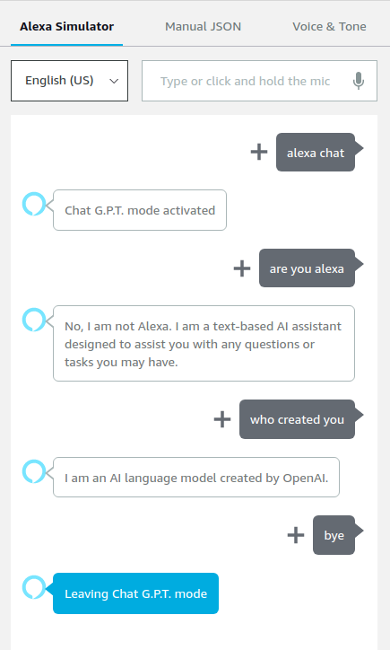
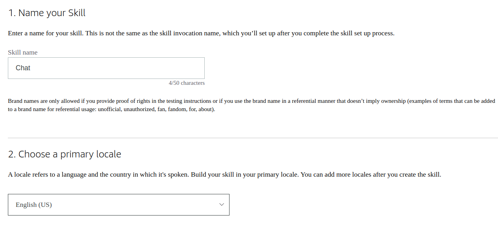
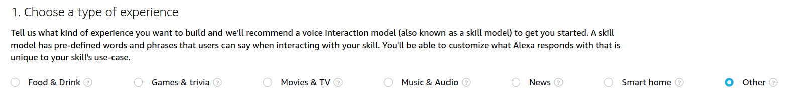
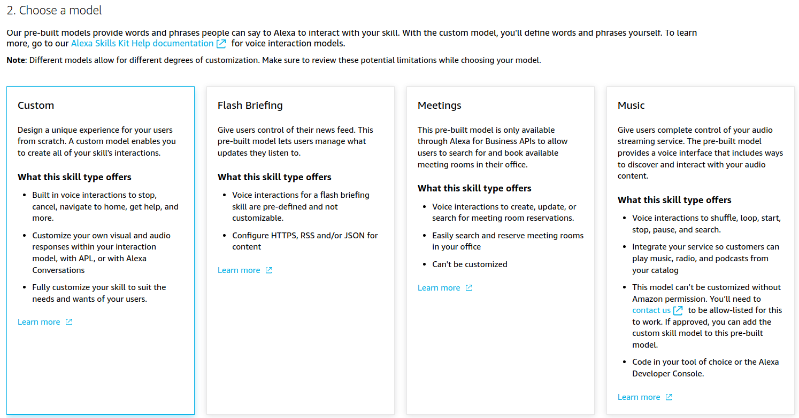
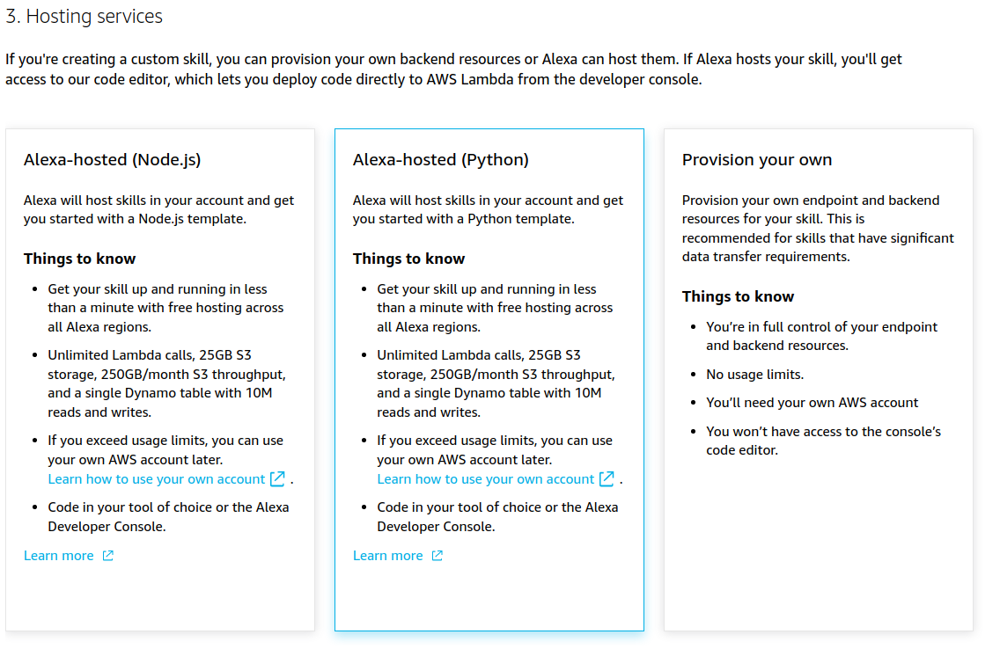
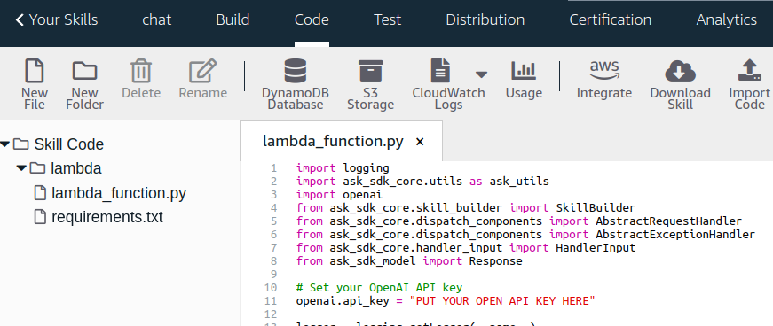

# Alexa GPT

[](https://opensource.org/licenses/MIT)

Boost your Alexa by making it respond as ChatGPT.

This repository contains a tutorial on how to create a simple Alexa skill that uses the OpenAI API to generate responses from the ChatGPT model.

<div align="center">
  
</div>

## Prerequisites

- An [Amazon Developer account](https://developer.amazon.com/)
- An [OpenAI API key](https://beta.openai.com/signup/)

## Step-by-step tutorial

### 1. <span name=item-1></span>
Log in to your Amazon Developer account and navigate to the [Alexa Developer Console](https://developer.amazon.com/alexa/console/ask).

### 2.
Click on "Create Skill" and name the skill "Chat". Choose the primary locale according to your language.



### 3.
Choose "Other" and "Custom" for the model.





### 4.
Choose "Alexa-hosted (Python)" for the backend resources.



### 5.
You now have two options:
- Click on "Import Skill", paste the link of this repository (https://github.com/k4l1sh/alexa-gpt.git), click "Import" and go directly to [step 12](#12)


Or if you want to import the skill manually
- Select "Start from Scratch", click "Create Skill" and go to [step 6](#6)


### 6.
In the "Build" section, navigate to the "JSON Editor" tab.

### 7.
Replace the existing JSON content with the [provided JSON content](json_editor.json):

```json
{
    "interactionModel": {
        "languageModel": {
            "invocationName": "chat",
            "intents": [
                {
                    "name": "GptQueryIntent",
                    "slots": [
                        {
                            "name": "query",
                            "type": "AMAZON.Person"
                        }
                    ],
                    "samples": [
                        "{query}"
                    ]
                },
                {
                    "name": "AMAZON.CancelIntent",
                    "samples": []
                },
                {
                    "name": "AMAZON.HelpIntent",
                    "samples": []
                },
                {
                    "name": "AMAZON.StopIntent",
                    "samples": []
                },
                {
                    "name": "AMAZON.NavigateHomeIntent",
                    "samples": []
                }
            ],
            "types": []
        }
    }
}
```


### 8.
Save the model and click on "Build Model".

### 9.
Go to "Code" section and add "openai" to requirements.txt. Your requirements.txt should look like this:

```txt
ask-sdk-core==1.11.0
boto3==1.9.216
openai
```

### 10.
Create an OpenAI API key by [signing up](https://beta.openai.com/signup/) and clicking in "+ Create new secret key" in the [API keys page](https://platform.openai.com/account/api-keys).

### 11.
Replace your lambda_functions.py file with the [provided lambda_function.py](lambda/lambda_function.py).

```python
import logging
import ask_sdk_core.utils as ask_utils
import openai
from ask_sdk_core.skill_builder import SkillBuilder
from ask_sdk_core.dispatch_components import AbstractRequestHandler
from ask_sdk_core.dispatch_components import AbstractExceptionHandler
from ask_sdk_core.handler_input import HandlerInput
from ask_sdk_model import Response

# Set your OpenAI API key
openai.api_key = "PUT YOUR OPENAI API KEY HERE"

logger = logging.getLogger(__name__)
logger.setLevel(logging.INFO)

class LaunchRequestHandler(AbstractRequestHandler):
    """Handler for Skill Launch."""
    def can_handle(self, handler_input):
        # type: (HandlerInput) -> bool

        return ask_utils.is_request_type("LaunchRequest")(handler_input)

    def handle(self, handler_input):
        # type: (HandlerInput) -> Response
        speak_output = "Chat G.P.T. mode activated"

        return (
            handler_input.response_builder
                .speak(speak_output)
                .ask(speak_output)
                .response
        )

class GptQueryIntentHandler(AbstractRequestHandler):
    """Handler for Gpt Query Intent."""
    def can_handle(self, handler_input):
        # type: (HandlerInput) -> bool
        return ask_utils.is_intent_name("GptQueryIntent")(handler_input)

    def handle(self, handler_input):
        # type: (HandlerInput) -> Response
        query = handler_input.request_envelope.request.intent.slots["query"].value
        response = generate_gpt_response(query)

        return (
                handler_input.response_builder
                    .speak(response)
                    .ask("Any other questions?")
                    .response
            )

class CatchAllExceptionHandler(AbstractExceptionHandler):
    """Generic error handling to capture any syntax or routing errors."""
    def can_handle(self, handler_input, exception):
        # type: (HandlerInput, Exception) -> bool
        return True

    def handle(self, handler_input, exception):
        # type: (HandlerInput, Exception) -> Response
        logger.error(exception, exc_info=True)

        speak_output = "Sorry, I had trouble doing what you asked. Please try again."

        return (
            handler_input.response_builder
                .speak(speak_output)
                .ask(speak_output)
                .response
        )

class CancelOrStopIntentHandler(AbstractRequestHandler):
    """Single handler for Cancel and Stop Intent."""
    def can_handle(self, handler_input):
        # type: (HandlerInput) -> bool
        return (ask_utils.is_intent_name("AMAZON.CancelIntent")(handler_input) or
                ask_utils.is_intent_name("AMAZON.StopIntent")(handler_input))

    def handle(self, handler_input):
        # type: (HandlerInput) -> Response
        speak_output = "Leaving Chat G.P.T. mode"

        return (
            handler_input.response_builder
                .speak(speak_output)
                .response
        )

def generate_gpt_response(query):
    try:
        messages = [{"role": "system", "content": "You are a helpful assistant."},
                    {"role": "user", "content": query}]
        response = openai.ChatCompletion.create(
            model="gpt-3.5-turbo",
            messages=messages,
            max_tokens=100,
            n=1,
            stop=None,
            temperature=0.5
        )
        return response['choices'][0]['message']['content'].strip()
    except Exception as e:
        return f"Error generating response: {str(e)}"

sb = SkillBuilder()

sb.add_request_handler(LaunchRequestHandler())
sb.add_request_handler(GptQueryIntentHandler())
sb.add_request_handler(CancelOrStopIntentHandler())
sb.add_exception_handler(CatchAllExceptionHandler())

lambda_handler = sb.lambda_handler()
```

### 12.
Put your OpenAI API key that you got from your [OpenAI account](https://platform.openai.com/account/api-keys/)



### 13.
Save and deploy. Go to "Test" section and enable "Skill testing" in "Development".


### 14.
You are now ready to use your Alexa in ChatGPT mode. You should see results like this:


Please note that running this skill will incur costs for using both AWS Lambda and the OpenAI API. Make sure you understand the pricing structure and monitor your usage to avoid unexpected charges.